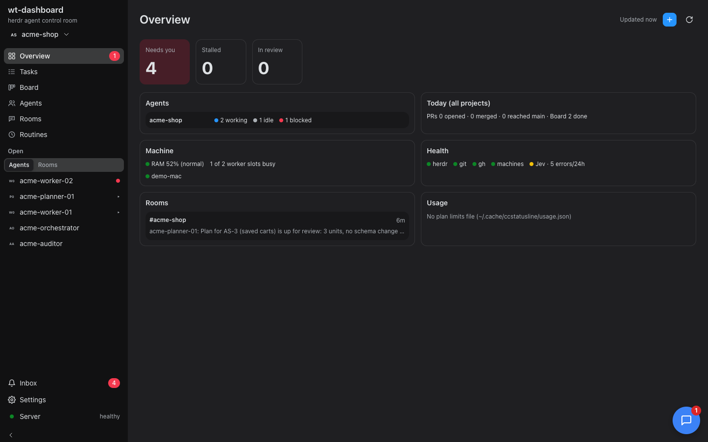
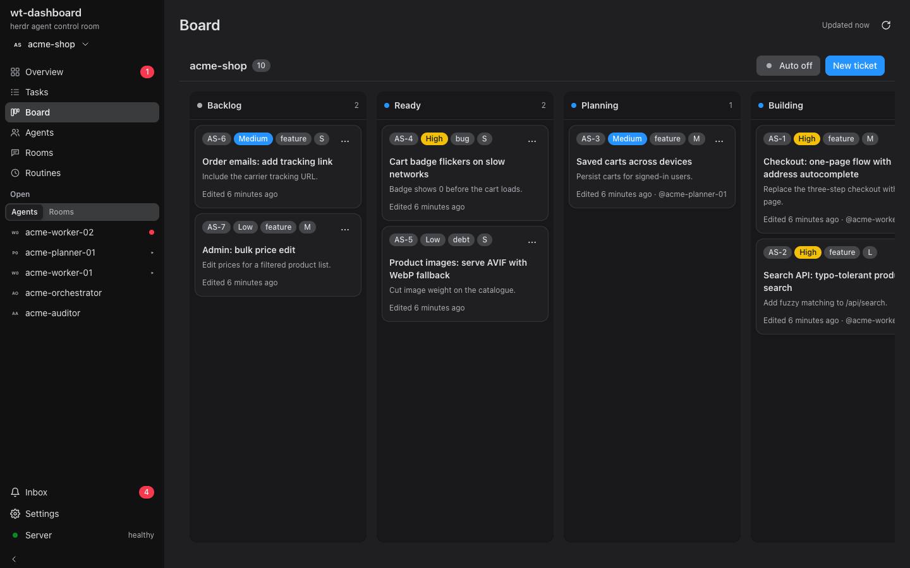
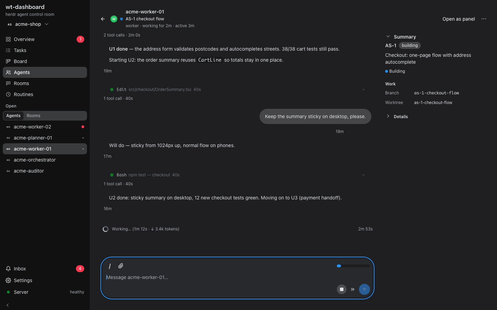
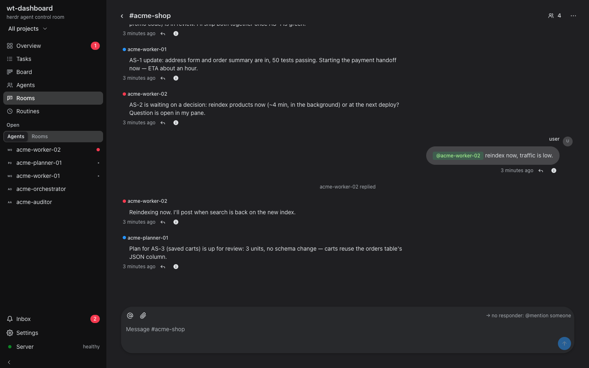
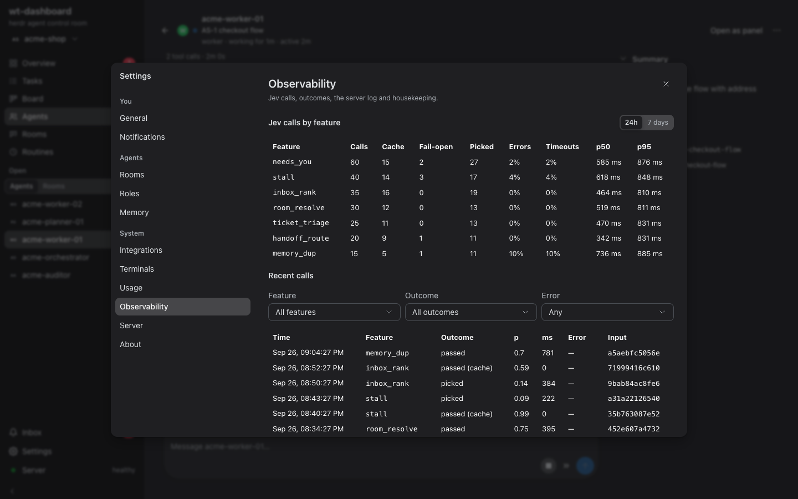
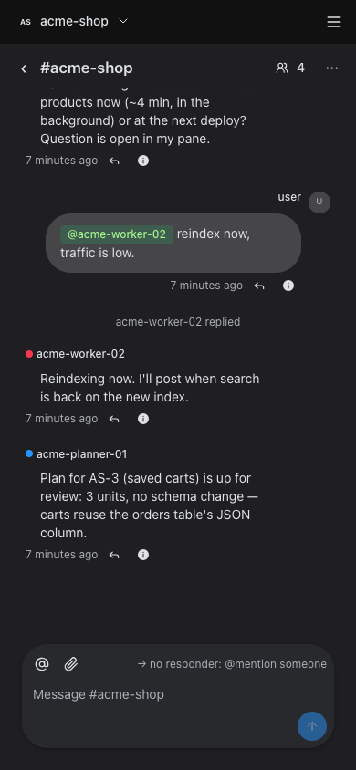

<p align="center">
  <picture>
    <source media="(prefers-color-scheme: dark)" srcset="docs/assets/banner-dark.svg">
    
  </picture>
</p>

<p align="center">
  <b>Plan, build, review and ship tickets with a team of Claude Code agents — each in its own git worktree, all in one control room.</b>
</p>

<p align="center">
  
  
  
  
  
  <a href="LICENSE"></a>
</p>

<p align="center">
  <a href="#quick-start">Quick start</a> ·
  <a href="#the-dashboard">Dashboard</a> ·
  <a href="#skills">Skills</a> ·
  <a href="#architecture">Architecture</a> ·
  <a href="docs/features.md">Feature reference</a> ·
  <a href="#contributing">Contributing</a>
</p>

---

## What it is

wt-pack is a set of [Claude Code](https://claude.com/claude-code) skills plus a local web dashboard.
Together they turn a handful of Claude Code sessions, run by [herdr](https://herdr.dev), into a small
team with defined roles:

- An **orchestrator** picks Ready tickets and hands them off.
- **Planners** research a ticket and write a reviewed plan.
- **Workers** implement the plan in an isolated worktree, then simplify, review and ship it.
- An **auditor** uses the product and files what to fix next.

Each ticket follows the same loop: research → plan → work → simplify → review → ship → babysit →
compound. You watch and steer the whole thing from **wt-dashboard**: the agents, their conversations, the
board, shared rooms, and the moments that need you.

## Features

| | |
|---|---|
| 🧭 **Ticket pipeline** | `wt-plan` → `wt-work` → `wt-ship`: evidence-backed plans, unit-by-unit implementation, then simplify, review and ship from one read of the diff. |
| 🌳 **One worktree per ticket** | Every ticket runs on its own branch and checkout, so agents never step on each other. `wt-finish` retires the worktree once it has merged. |
| 🤝 **Named agent pools** | `wt-agents spawn planner\|worker\|auditor`. Handoffs label the target pane with its task, and both ends know how to reach each other. |
| 🗂️ **Local kanban board** | `wt-ticket` keeps per-project tickets (`AS-12`) on disk. Optional Dispatch sends Ready cards to free agents on its own. |
| 💬 **Rooms** | Chat rooms shared by you and your agents. @mention an agent to deliver a message into its session. |
| 🔔 **Needs you** | An inbox and native notifications when an agent is blocked on a question, stalled, or done. |
| 🧠 **Shared memory** | `wt-memory` keeps global, per-role and per-project preferences, which a Claude Code plugin injects into every session. |
| 📈 **Observability** | Call stats, outcomes, the server log and housekeeping for the optional judgment layer. |
| 🖥️ **Mac app** | A Tauri shell around the same dashboard UI shown below, with a tray menu that shows how many agents need you. |

## The dashboard

<p align="center"></p>

<table>
  <tr>
    <td width="50%"><br><sub><b>Board</b>: per-project tickets, sizes, priorities and assignees.</sub></td>
    <td width="50%"><br><sub><b>Agent chat</b>: the live transcript, tool calls, and the ticket and worktree it is on.</sub></td>
  </tr>
  <tr>
    <td width="50%"><br><sub><b>Rooms</b>: you and your agents in one thread. An @mention delivers into the agent's session.</sub></td>
    <td width="50%"><br><sub><b>Observability</b>: calls, cache hits, error rates and p50/p95 per feature.</sub></td>
  </tr>
</table>

<p align="center"><br><sub>It works on a phone too, over Tailscale.</sub></p>

<sub>The screenshots use a throwaway demo project (`acme-shop`) with simulated agents.</sub>

## Quick start

You need macOS or Linux, Node ≥ 22.13, Git, [`gh`](https://cli.github.com),
[herdr](https://herdr.dev) and Claude Code.

```sh
git clone https://github.com/rephol/wt-pack.git ~/Work/projects/wt-pack
~/Work/projects/wt-pack/setup
```

`setup` does four things:

- links every `skills/wt-*` into `~/.claude/skills`;
- installs the wt-memory plugin;
- builds the dashboard and runs it under launchd (macOS) at <http://127.0.0.1:7777>;
- prints a doctor report.

It asks once before installing missing Homebrew packages (`--yes` skips the question). It never repoints
an install that belongs to another checkout, and running it again changes nothing.

```sh
./setup doctor       # what is missing, one line each; exit 1 while a required check fails
./setup secrets      # optional TypeSafe key (Linear: dashboard Settings › Integrations)
./setup uninstall    # service, plugin, links; keeps data and keys (--purge deletes dashboard data/config)
```

Inside Claude Code, "set up wt-pack" runs the `wt-setup` skill, which drives the same script. Linux works
without launchd, Keychain or the Tauri app; `doctor` lists what to do by hand.

## Skills

Each directory under `skills/` is one skill, linked as `~/.claude/skills/<name>`.

| Skill | What it does |
|---|---|
| `wt-plan` | Ticket → worktree → sharded research → a reviewed, committed plan → handoff |
| `wt-research` | Evidence about a ticket or change, as structured findings with quoted sources |
| `wt-work` | Implements a plan unit by unit, choosing an evidence strategy for each unit |
| `wt-ship` | Simplify → review → record learnings → open or merge, in that order |
| `wt-simplify` · `wt-review` · `wt-compound` · `wt-pr` | The steps `wt-ship` runs, each also usable on its own |
| `wt-babysit` | Watches a PR until it is merge-ready |
| `wt-finish` | Retires a merged worktree and its branch |
| `wt-agents` | Spawns, lists and removes named herdr agents (planners, workers, auditors) |
| `wt-handoff` | Hands a prompt to an agent as a `/goal`, labelling both ends |
| `wt-audit` | The auditor's loop: use the product, file findings, rank what to do next |
| `wt-ticket` | The local kanban board CLI |
| `wt-room` | The rooms CLI |
| `wt-memory` | Durable preferences for every agent, per role and per project |
| `wt-dashboard` | The control room: a Node server, the web UI and the Mac app |
| `wt-setup` | Runs `./setup` |
| `wt-shared` | Not a skill: scripts the other skills call by path |

## Architecture

- **Agents** are Claude Code sessions in herdr panes. Pane tokens carry each agent's role, project and task.
- **wt-dashboard** is a dependency-free Node server (`skills/wt-dashboard/server.mjs`) with a
  `node:sqlite` store for tickets, rooms and the inbox. It reads herdr, git and `gh` to show state,
  and Claude Code's own JSONL transcripts for the chat view.
- **The web UI** (React 19, Vite, TanStack Query) is served by that server on loopback, behind a session
  cookie and a Host/Origin allowlist. **The Mac app** is a Tauri 2 shell around the same UI.
- **The optional judgment layer** (`skills/wt-shared/scripts/wt-judge.mjs`) turns decisions the pack
  otherwise eyeballs into typed, logged judgments through the TypeSafe API. Unconfigured is the normal
  case: every caller treats exit 3 (no `TYPESAFE_API_KEY`) as "do what the pack always did". Its log
  (`~/.claude/wt-judge-log.jsonl`) and any calibrated thresholds stay on the machine that made them. Two
  subcommands ship ADVISORY: they rank what to read, but never shrink what gets read.

Everything else, including what every feature does, where it lives and its defaults, is in
**[docs/features.md](docs/features.md)**. Operator detail (the service, data layout, rollback) is in
[skills/wt-dashboard/README.md](skills/wt-dashboard/README.md).

## Contributing

Issues and pull requests are welcome. [CONTRIBUTING.md](CONTRIBUTING.md) covers setup, the repo layout, running
the tests, and the rules a change follows (one commit per skill, backward-compatible CLIs, docs/features.md in
the same change).

## License

[MIT](LICENSE) © 2026 rephol
